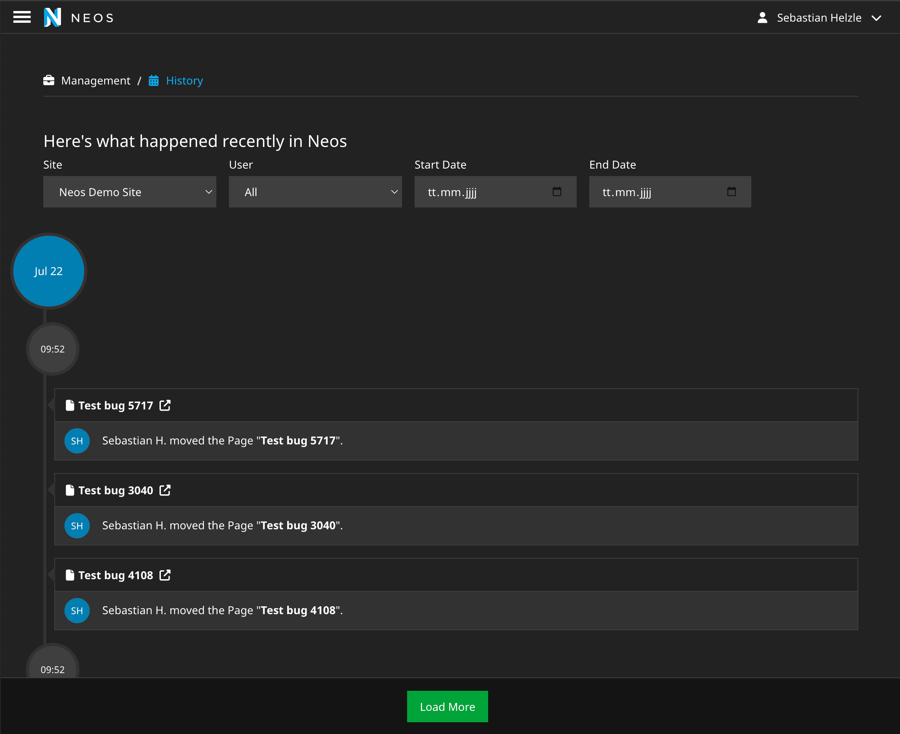
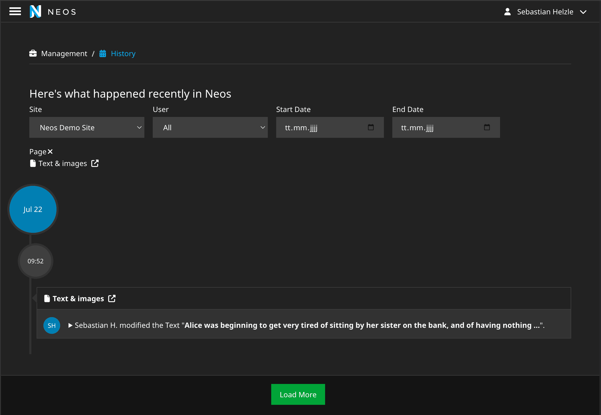

# Shel.Neos.History

## Introduction

This package provides an improved history backend module for Neos.

It provides an improved event overview with site filtering, viewing for a specific document node as well as actual view of changes.

Additionally, it provides a link in the node info view for document nodes in the content module.

Hides account creation/deletion events.

This package is a modernized fork for Neos 8.x of the [AE.History](https://github.com/aertmann/history) package by Aske Ertmann. 

## Installation

`composer require "shel/neos-history"`

## Screenshots

TODO: Update outdated screenshots

General overview with site selection

View of history for specific page

## License

See [LICENSE](./LICENSE).
